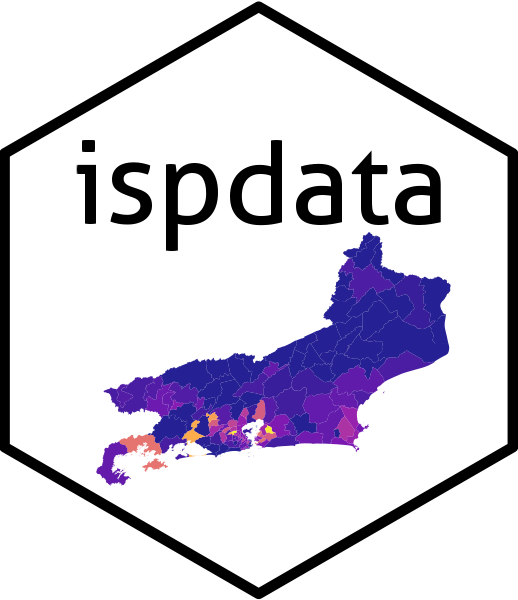
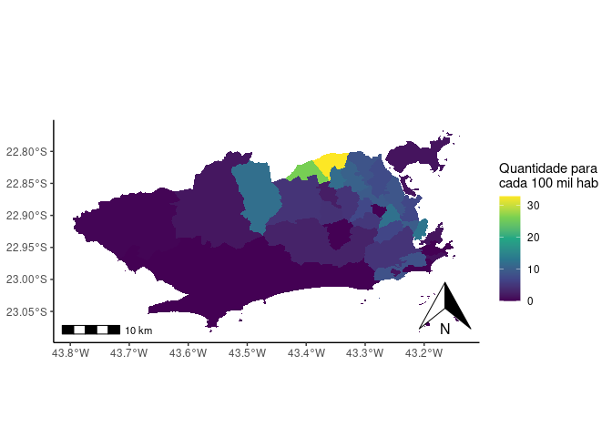

<!-- README.md is generated from README.Rmd. Please edit that file -->

# ispdata 

<!-- badges: start -->

[](https://cran.r-project.org/package=ispdata)
[](https://CRAN.R-project.org/package=ispdata)
[](https://CRAN.R-project.org/package=ispdata)
<!-- badges: end -->

## Sobre o pacote

O pacote ispdata permite acessar os dados do Instituto de Segurança
Pública (ISP) do Rio de Janeiro por meio do R.

## Instalação

Para instalar via [CRAN](https://CRAN.R-project.org/package=ispdata):

``` r
install.packages("ispdata")
library(ispdata)
```

Para instalar a versão em
desenvolvimento[(GitHub)](https://github.com/igorlaltuf/ispdata):

``` r
install.packages("devtools")
devtools::install_github("igorlaltuf/ispdata")
library(ispdata)
```

## Exemplos

Acessar estatísticas de segurança pública por área de delegacia de
polícia:

``` r
df <- monthly_stats(by = 'cisp') 
```

Carregar o dicionário de dados da tabela acima:

``` r
data_dictionary <- monthly_stats_dictionary(by = 'cisp')
```

Acessar dados sobre feminicídio:

``` r
df <- crimes_against_life(type = "femicide")
```

Ver estatísticas sobre apreensão de armas:

``` r
df <- gun_seizure(gun_type = "firearms")
```

Carregar estatísticas de segurança pública em área de UPPs:

``` r
df <- upp_data(data = "stats")
```

Dados espaciais vetoriais dos limites das UPPs:

``` r
shape <- spatial_upp
```

Exemplo: Taxa de homicídios por intervenção policial em 2020 na cidade
do Rio de Janeiro. Dados por Área Integrada de Segurança Pública (AISP).

``` r

library(ispdata)
library(dplyr)
library(ggplot2)
library(sf)

pop <- population(data = 'cisp_yearly')

df <- monthly_stats(by = 'cisp') |> 
  left_join(spatial_cisp, by = c("cisp" = "dp", "aisp")) |>
  filter(aisp %in% c(27, 40, 31, 14, 18, 41, 9, 6, 23, 3, 16, 22, 4, 17, 19, 2),
         ano == '2020') |>
  group_by(ano, cisp, geometry) |>
  summarise(hom_por_interv_policial = sum(hom_por_interv_policial)) |>
  left_join(pop, by = c("cisp" = "circ", "ano")) |>
  mutate(v_100k_hab = hom_por_interv_policial/pop * 100000) |>
  st_as_sf() 


ggplot() + 
  geom_sf(data = df, mapping = aes(fill = v_100k_hab), color = NA) +
  theme_classic() +
  scale_fill_viridis_c(name = "Quantidade para\ncada 100 mil hab") + 
  labs(title = "",
       subtitle = "") +
  coord_sf() +
  ggspatial::annotation_scale() +
  ggspatial::annotation_north_arrow(location = "br")
```



## Citação

Para citar em trabalhos, use:

``` r
citation('ispdata')
#> 
#> To cite package 'ispdata' in publications use:
#> 
#> 
#> A BibTeX entry for LaTeX users is
#> 
#>   @Misc{,
#>     title = {ISPDATA: the package to access public security data from the State of Rio de Janeiro.},
#>     author = {Igor Laltuf},
#>     year = {2023},
#>     url = {https://github.com/igorlaltuf/ispdata},
#>   }
```
